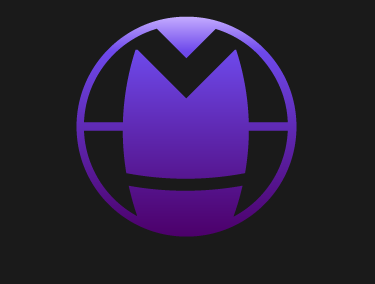

# MassHealth

<div align="center">
  
  
  
  **Personalized fitness tracking and workout planning application**
  
  [](https://opensource.org/licenses/MIT)
  [](https://reactjs.org/)
  [](https://supabase.com/)
  [](https://www.docker.com/)

</div>

## 📋 Overview

MassHealth is a comprehensive fitness application designed to help users improve their health and physical fitness through personalized workout routines. The application combines various types of exercises - from running to strength training - adapting to the user's health status and fitness level.

### ✨ Key Features

- **Personalized Workout Routines** - Tailored to individual fitness levels and health conditions
- **Exercise Database** - Comprehensive collection sourced from [Muscle Wiki](https://musclewiki.com), [Muscle & Strenght](https://www.muscleandstrength.com) and [Free Exercise DB](https://github.com/drksv/free-exercise-gym?tab=readme-ov-file)
- **GPS Tracking** - Monitor and visualize your running routes
- **Progress Analytics** - Track your improvement over time with detailed visualizations
- **Cross-Platform** - Available on iOS, Android, web, and tablets

## 🚀 Getting Started

### Prerequisites

- [Docker](https://www.docker.com/get-started)
- [Node.js](https://nodejs.org/) (v14.x or higher)
- [npm](https://www.npmjs.com/) (v7.x or higher)

### Installation

1. Clone the repository
   ```bash
   git clone https://github.com/username/masshealth.git
   cd masshealth
   ```

2. Start the development environment using start.sh
   ```bash
   .\start.ps1
   ```

3. Follow the instructions on screen to run the app.

## 🏗️ Project Structure

The project is divided into two main phases:

### Phase 1: System Setup & Infrastructure

- Jira task management
- GitHub repository setup
- CI/CD pipeline with GitHub Actions
- React application foundation
- Supabase backend with Docker
- Docker Compose orchestration
- Test environment configuration
- Technical documentation

### Phase 2: Feature Development

- Core application logic
- Web scraper for exercise data
- Mobile-responsive UI
- Tablet and web views
- Two-factor authentication
- GPS integration
- MQTT protocol implementation
- System scalability
- Error monitoring
- UX testing and feedback collection
- User and developer documentation

## 🧩 Use Cases

- **Fitness Improvement** - Get a personalized program based on your current fitness level
- **Specialized Training** - Explore specific workout types (calisthenics, HIIT, yoga)
- **Adapted Exercise** - Safe routines for users with health limitations
- **Custom Workouts** - Create your own exercise routines from our database
- **Running Progress** - Track your routes, pace, time, and calories burned

## 🎨 Design

MassHealth features a modern, minimalist design with:

- A color scheme combining purple (symbolizing strength and balance) and green (representing health and vitality)
- Clean lines and interactive animations
- Light mode with dark mode option
- Tag-based filtering system for exercises

## 🛠️ Tech Stack

- **Frontend**: React
- **Backend**: Supabase
- **Authentication**: SSO (Google, Apple, Microsoft) with Face Recognition option
- **Containerization**: Docker
- **Task Management**: Jira
- **Version Control**: GitHub
- **Development Environment**: Visual Studio Code
- **Testing**: Jest, Cypress
- **Monitoring**: Sentry/LogRocket

## 👥 Team

- Maksim Loknar
- Damijana Kuharič

## 🔍 Project Mentors

- Uroš Mlakar
- Sandi Majninger

## 📄 License

This project is licensed under the MIT License - see the [LICENSE](LICENSE) file for details.

---

<div align="center">
  <sub>Built with ❤️ in Maribor, Slovenia | 2025</sub>
</div>
